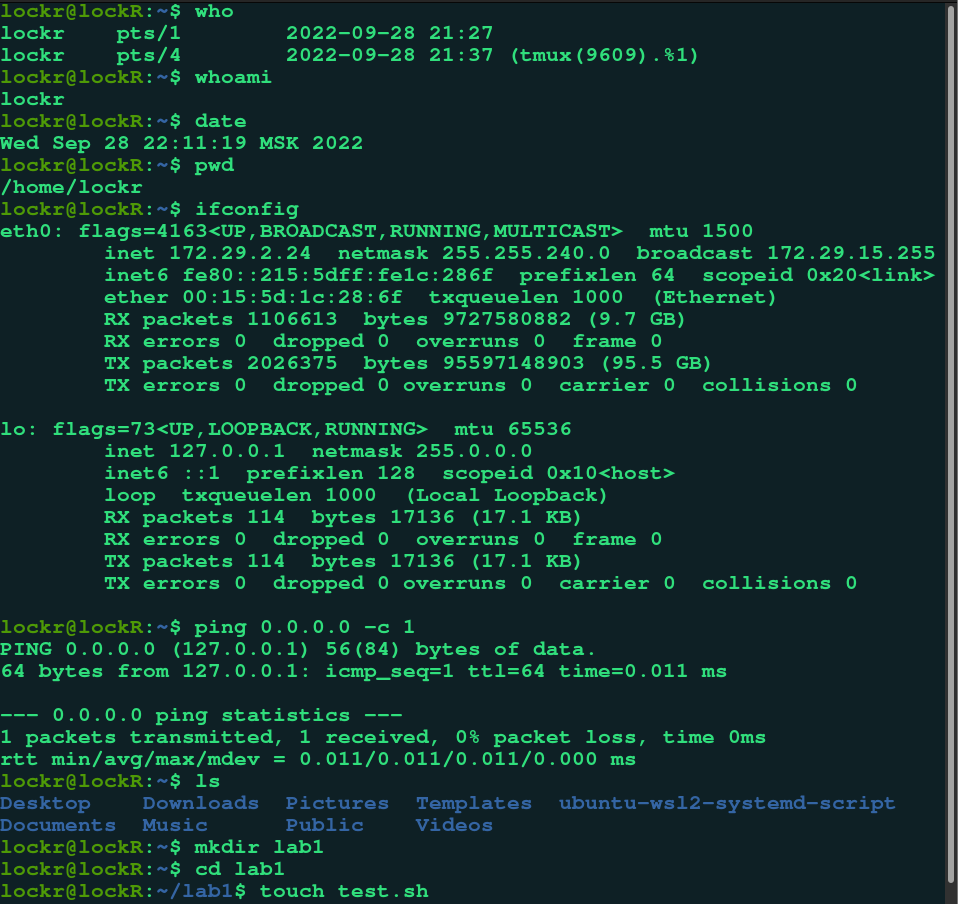
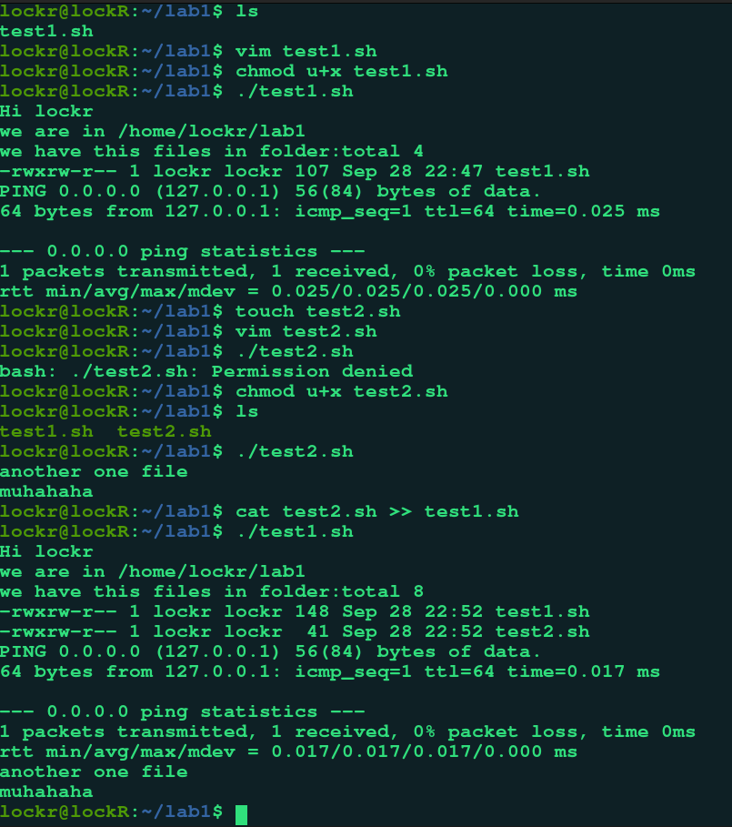
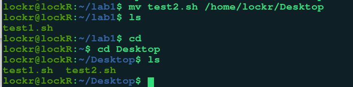
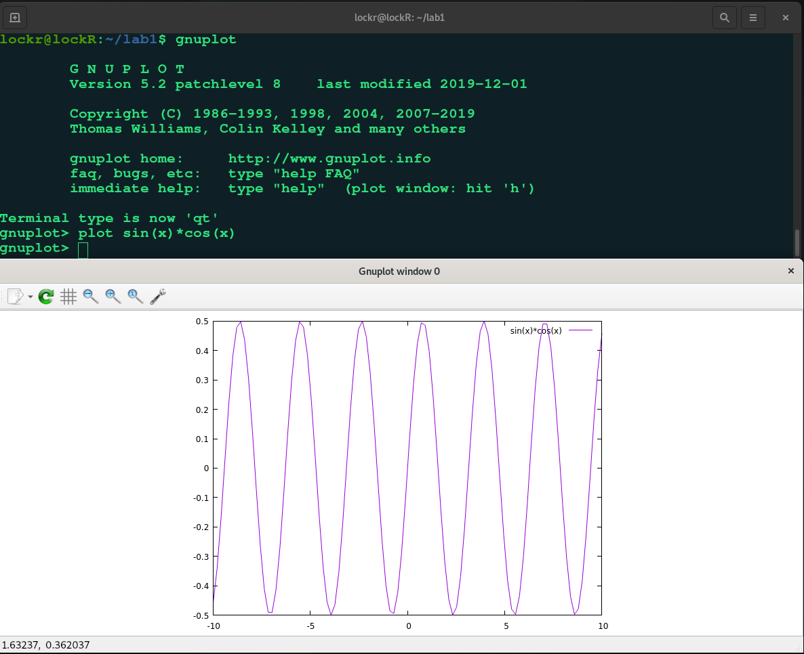

# Отчет по лабораторной работе №2 по курсу "Фундаментальная информатика"

___Группа:___ М8О-108Б-22 \
___№ по списку:___ 9 \
___Контакты:___ doly2004e@yandex.ru +7(996)420-81-82 \
___ФИО:___ Ибрагимов Далгат Магомедалиевич \
___Преподаватель:___ Сахарин Никита Александрович

### 1. Тема
__Операционная среда ОС UNIX__

### 2. Цель работы
__Изучение и освоение программного обеспечения ОС UNIX и приобретение навыков, необходимых для выполнения курсовых и лабораторных работ в среде UNIX__

### 3. Задание
__Опробовать основные команды для работы с каталогами, директориями, текстовыми файлами, некоторыми утилитами и т.д.__

### 4. Оборудование
___Процессор___: AMD Ryzen 5 5600H (12) @ 3.600GHz \
___ОП___: 32768MiB \
___Твердотельный накопитель___: 512GiB

### 5. Программное обеспечение
___Слой совместимости для запуска Linux-приложений в ОС Windows___ WSL2, ___версия ядра___ 5.10.102.1 \
___Операционная система семейства___ UNIX, ___наименование___  Ubuntu, ___версия___ 20.04 LTS, ___на базе ядра___ GNU/Linux 5.10.16.3-microsoft-standard-WSL2 x86_64 \
___Интерпретатор команд___ bash, ___версия___ 5.1.16 \
___Редактор текстов___ vim8 ___версия___ 8.0 \

### 6. Идея, метод, алгоритм решения
__  __

### 7. Сценарий выполнения работы
#### Используемые команды

date

_вывод системного времени_

who

_получение информации о пользователях, которые подключены к системе, в том числе и об терминальных сессиях, через которые происходит подключение_

whoami

_печатает имя пользователя с действующим идентификатором пользователя_

pwd 

_вывести полный путь до текущей рабочей директории, в которой находится пользователь_

ifconfig

_команда для настройки сети_

ping

_проверка доступности удаленного узла в сети_

ls, l

_выводит содержимое каталогов и информацию о файлах_

cd

_изменение текущего рабочего каталога_

cp

_копирование файлов и каталогов_

mv

_перемещение файлов и каталогов_

touch

_предназначенная для установки времени последнего изменения файла или доступа в текущее время. Также используется для создания пустых файлов_

chmod

cat

_может читать и объединять файлы, записывая их содержимое в стандартный вывод_

mkdir

_создание каталогов_

rm

_удаление файлов и целых деревьев каталогов__

rmdir

_удаление каталогов из файловой системы_

man 

_просмотр справочных руководств системы_

vi, vim

_текстовый редактор_

gnuplot

_свободная программа для создания двух- и трёхмерных графиков_
  
  set terminal
  
  _выбор способа вывода_
  
  plot <функция>
  
  _стандартная команда для отрисовывания графиков функций_
  
___test1.sh___

```
echo "Hi $(whoami)"
echo "we are in $(pwd)"
echo "we have this files in folder:$(ls -l)"
ping 0.0.0.0 -c 1

```

___test1.sh___

```
echo "another one file"

echo "muhahaha"
```

### 8. Распечатка протокола

 \
 \
 \
___Использование GNUPLOT:___


### 9. Выводы

Я ознакомился с основными командами ОС UNIX, научился перемещаться по директориям, создавать, редактировать, читать, удалять файлы. Получил базовые навыки владения ОС UNIX.
