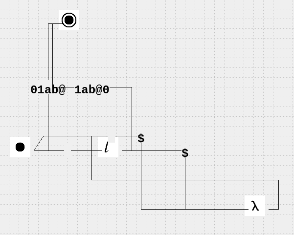
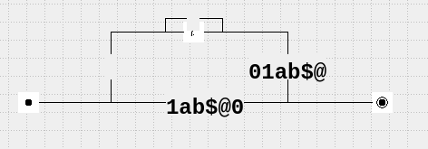

# Отчёт по лабораторной работе №2 по курсу “Фундаментальная информатика”

<b>Студент группы:</b> <ins>М80-108Б-22 Ибрагимов Далгат Магомедалиевич, № по списку 9</ins> 

<b>Контакты e-mail:</b> <ins>doly2004e@yandex.ru</ins>

<b>Работа выполнена:</b> «19» <ins>октября</ins> <ins>2022</ins> г.

<b>Преподаватель:</b> <ins>асп. каф. 806 Сахарин Никита Александрович</ins>

<b>Входной контроль знаний с оценкой:</b> <ins>5</ins>

<b>Отчет сдан</b> «_» <ins>_</ins> <ins>2022</ins> г., <b>итоговая оценка:</b> <ins>5</ins>

<b>Подпись преподавателя:</b> ________________

## 1. Тема
Конструирование диаграмм Тьюринга
## 2. Цель работы
Сконструировать диаграмму Тьюринга, выполняющую заданное действие над словами, записанными на ленте.
## 3. Задание (вариант № 29*)
Вычисление поразрядной дизъюнкции двуз двоичных чисел(слова разной длины, дополняются 0 слева).
## 4. Оборудование
<b>Процессор:</b> AMD Ryzen 5 5600H (12) @ 3.600GHz 

<b>ОП:</b> 32GiB 3200 MHz LPDDR4 

<b>SSD:</b> 512 GiB 

<b>Адрес:</b>  

<b>Монитор:</b> 27-дюймовый (1920 х 1080) 

<b>Графика:</b>AMD Radeon™ RX 6600M 2177 MHz 8GiB GDDR6 

## 5. Программное обеспечение:
<b>Слой совместимости для запуска Linux-приложений в ОС Windows:</b> WSL2 5.10.102.1 

<b>Операционная система семейства UNIX:</b> Ubuntu 20.04 LTS GNU/Linux 5.10.16.3-microsoft-standard-WSL2 x86_64 

<b>Интерпретатор команд:</b>_ 

<b>Система программирования:</b>— 

<b>Редактор текстов:</b>_ 

<b>Утилиты операционной системы:</b>_ 

<b>Прикладные системы и программы:</b>_ 

<b>Местонахождение и имена файлов программ и данных на домашнем компьютере:</b> /home/lockr 

## 6. Идея, метод, алгоритм решения задачи (в формах: словесной, псевдокода, графической [блок-схема, диаграмма, рисунок, таблица] или формальные спецификации с пред- и постусловиями)
Вычисление поразрядной дизъюнкции двуз двоичных чисел(слова разной длины, дополняются 0 слева).
## 7. Сценарий выполнения работы [план работы, первоначальный текст программы в черновике (можно на отдельном листе) и тесты либо соображения по тестированию]. 
1. Копируем входные данные;
2. Зачищаем первое число в скопированных данных;
3. Выполняем поразрядную дизъюнкцию первого числа из входных данных и оставшегося(второго) числа из скопирвоанных справа налевоЮ постекпенно заменяя на врменные символы {a, b};
4. Переносим полученные данные на растояние в один пробел от исходных;
5. Возвразщаем 0 и 1 заместо a и b соответсвенно, а также зачищаем от использованных спец. символов;
6. Возвращаемся в исходную позицию.

Пункты 1-6 отчета составляются сторого до начала лабораторной работы.
Допущен к выполнению работы.  
Подпись преподавателя _____________________
## 8. Распечатка протокола

## 9. Дневник отладки должен содержать дату и время сеансов отладки и основные события (ошибки в сценарии и программе, нестандартные ситуации) и краткие комментарии к ним. В дневнике отладки приводятся сведения об использовании других ЭВМ, существенном участии преподавателя и других лиц в написании и отладке программы.

| № |  Лаб. или дом. | Дата | Время | Событие | Действие по исправлению | Примечание |
| ------ | ------ | ------ | ------ | ------ | ------ | ------ |
| 1 | дом. | 08.10.22 | 13:00 | Выполнение лабораторной работы | - | - |
## 10. Замечания автора по существу работы — Симметрическая разность двух двочиных чисел.

## 11. Выводы
Были изучены базовые команды для построения диаграммы Тьюринга. Был продуман и написан алгоритм для выполнения лабораторной работы. Были приобретены навыки, необходимые для дальнейшего обучения.

Недочёты при выполнении задания могут быть устранены следующим образом: —

</b>Подпись студента</b> _________________

